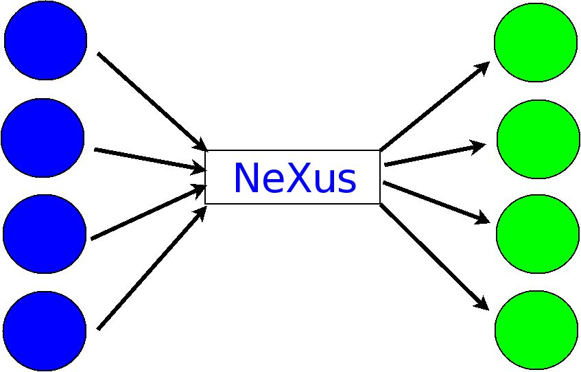

.. $Id$

..  _UnifiedFormat:

***************************************************************************
A Unified Format for Reduction and Analysis
***************************************************************************

.. index:: NeXus basic motivation; unified format

Another important motivation for NeXus, indeed the *raison d'etre*, was 
the community need to analyze data from different user facilities. A 
single data format that is in use at a variety of facilities would provide 
a major benefit to the scientific community.  This unified format should 
be capable of describing any type of data from the scientific experiments, 
at any step of the process from data acquisition to data reduction and 
analysis. This unified format also needs to allow data to be written to 
storage as efficiently as possible to enable use with high-speed data 
acquisition.
 
.. hit these points: 
	Portable, 
	self describing, 
	extendable, 
	public domain

**Self-description**, combined with a reliance on a **multi-platform** 
(and thereby **portable**) data storage format, are valued components of a 
data storage format where the longevity of the data is expected to be 
longer than the lifetime of the facility at which it is acquired. As the 
name implies, self-description within data files is the practice where the 
structure of the information contained within the file is evident from the 
file itself. A multi-platform data storage format must faithfully 
represent the data identically on a variety of computer systems, 
regardless of the bit order or byte order or word size native to the 
computer.

The scientific community continues to grow the various types of data to be 
expressed in data files. This practice is expected to continue as part of 
the investigative process. To gain broad acceptance in the scientific user 
community, any data storage format proposed as a standard would need to be 
**extendable** and continue to provide a means to express the latest 
notions of scientific data.

The maintenance cost of common data structures meeting the motivations 
above (self-describing, portable, and extendable) is not insurmountable 
but is often well-beyond the research funding of individual members of the 
muon, neutron, and X-ray science communities. Since it is these members 
that drive the selection of a data storage format, it is necessary for the 
user cost to be as minimal as possible. In this case, experience has shown 
that the format must be in the **public-domain** for it to be commonly 
accepted as a standard. A benefit of the public-domain aspect is that the 
source code for the API is open and accessible, a point which has received 
notable comment in the scientific literature. 

..	PRJ: For example, there was a letter to the editor of J Appl Cryst 
		in the late 1970s complaining about the increasingly-common 
		practice of withholding the source code.  If we find the 
		reference, we should cite it here.

.. index:: API

More recently, NeXus has recognized that part of the scientific community 
with a desire to write and record scientific data, has small data volumes 
and a large aversion to the requirement of a complicated API necessary to 
access data in binary files such as HDF. For such information, the NeXus 
API has been extended by the addition of the eXtensible Markup Language 
(XML) [#]_ as an alternative to HDF. XML is a text-based format that 
supports compression and structured data and has broad usage in business 
and e-commerce. While possibly complicated, XML files are human readable, 
and tools for translation and extraction are plentiful. The API has 
routines to read and write XML data and to convert between HDF and XML. 

.. [#] XML: http://www.w3.org/XML/. 
	There are many other descriptions of XML, 
	for example:  http://en.wikipedia.org/wiki/XML

	
.. _CommonExchangeFormat:

NeXus as a Common Data Exchange Format
---------------------------------------------

By the late 1980s, it had become common practice for a scientific 
instrument or facility to define its own data format, often at the 
convenience of the local computer system. Data from these facilities were 
not easily interchanged due to various differences in computer systems and 
the compression schemes of binary data. It was necessary to contact the 
facility to obtain a description so that one could write an import routine 
in software. Experience with facilities closing (and subsequent lack of 
access to information describing the facility data format) revealed a 
significant limitation with this common practice.  Further, there existed 
a *N * N* number of conversion routines necessary to convert data between 
various formats. In the next figure, circles 
represent different data file formats while arrows represent conversion 
routines.  Note that the red circle only maps to one other format.

.. _fig.data-pre-nexus:

.. figure:: data-pre-nexus.jpg
	:width: 200 pt
	:alt: example NeXus data file hierarchy

	*N* separate file formats

One early idea has been for NeXus to become the common data exchange 
format, and thereby reduce the number of data conversion routines from 
*N * N* down to *2N*, as shown in the next figure.

.. _fig.data-post-nexus:

	*N* separate file formats joined by a common NeXus converter
