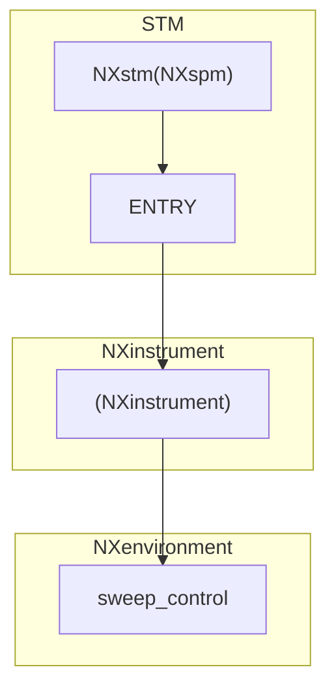

# Application Definition for SPM Domain

# General SPM Base Class


<!-- ```mermaid
graph TD;
  subgraph SPM
    %%hh%%
    id1["ENTRY"]
    id0["NXspm"]
    id3["NXdata"]
    id4["Reproducibility Indicators"]
    id2["NXinstrument"]
    id5["Resolution Indicators"]
    id6["NXsample"] 

  end

  subgraph NXinstrument
        %%NXinstrument Part%%
    id16["(NXamplifier)"]
    id14["(NXlockin)"]
    id13["(NXenvironment)"]
  end

  subgraph NXenvironment
    id21["SAMPLE_BIAS(NXiv_bias)"]
    id22["(NXpositioner_spm)"]
    id23["(NXscan_control)"]
    id24["(NXpiezo_config_spm)"]
  end

  id0 --> id1
  id1 --> id2
  id1 --> id3
  id1 --> id4
  id1 --> id5
  id1 --> id6

  id2 --> id13
  id2 --> id14
  id2 --> id16

  id13 --> id21
  id13 --> id22
  id13 --> id23
  id13 --> id24
  
```

## STM App Def

-->

## Revised App Def and Base Class for SPM Domain
1. SPM, STM, AFM, STS
2. Lockin, Bias_spectorscopy, Bias_sweep, Scan_control, Positioner_spm, 
3. piezoelectric_material, piezo_config_spm, rcs, cantilever_spm
# TODO:
1. Add scan type `trajectory` for STS in config and eln file.
2. lockin_current_flip_value --> lockin_current_flip_sign.
