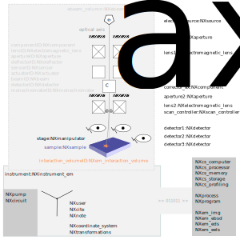
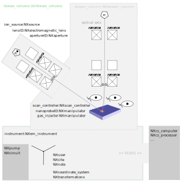
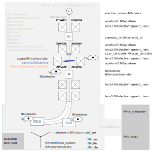

.. _AppDef-Em-Structure:

===================
Electron microscopy
===================

.. index::
   AppDef-Em-Introduction
   AppDef-Em-Design
   AppDef-Em-Definitions

.. _AppDef-Em-Introduction:

Introduction
############

A set of data schemas is available to describe components of an electron microscope (EM) and its focused-ion beam (FIB) capabilities if available.

Electron microscopes are functionally very customizable tools: Examples include multi-signal/-modal analyses which are frequently realized as
on-the-fly computational analyses, regularly switching between GUI-based instrument control, computational steps, and more and more using
high-throughput stream-based processing. Also artificial intelligence methods are increasingly used and are becoming more closely
interconnected with classical modes of controlling the instrument and performing data processing. A challenge in electron microscopy
is that these steps are often executed within commercial integrated control and analysis software. This makes it difficult to keep
track of workflows in a technology-partner-agnostic, i.e., in an interdisciplinary manner.

The application definitions and associated base classes were designed from the perspective of how electron microscopes are used in the
materials-science-branch of electron microscopy. Therefore, the focus is on the usage of electron microscopy in condensed-matter physics,
chemical physics of solids, and materials engineering applications.

The biology-/bio-materials-/omics-/life-science-community of the electron microscopy community can also take advantage of the definitions
and classes. We acknowledge that the Open Microscopy Environment (https://www.openmicroscopy.org) offers a data model and
schema set for the life science. Conceptual and semantic overlap between concepts of these two data models exist but should be explored
further in the future to improve on the interoperability of data exchange between the materials-science and life science communities.

.. _AppDef-Em-Design:

Design
######

NXem provides support for documenting research with scanning electron microscopes (SEM), scanning electron microscopes that are equipped with
focused-ion beam (FIB) capabilities (SEM/FIB), and transmission electron microscopes (TEM) respectively scanning transmission electron microscopy (STEM).
The actual design of the electron-optical beam path and individual components used differ. Therefore, the base classes of and application definition NXem
offers modular building blocks from which a virtual electron microscope is instantiated.

The following three figures provide one schematic example for each respective type of instrument (SEM, SEM/FIB, (S)TEM). Specifically, the figure
shows how the concepts of NXem can be used to describe each instrument. All figures are meant for illustrative and educational purposes.
The figures build up complexity successively starting with the simpler case of an SEM (Fig. 1), moving to an SEM with FIB capabilities (Fig. 2), and
arriving at an (S)TEM (Fig. 3) instrument. The capabilities that are illustrated for the SEM in Fig. 1 are also offered for all further cases.
For the sake of conciseness and clarity these classes are not repeated though in subsequent figures. The examples take the perspective of
typical users who are interested in reporting metadata and data that have been collected during a session with such microscopes: 

**Fig. 1** - an example for an SEM
The instrument is constructed from a so-called column, a housing for all technical components such as the electron source,
the lenses, like here shown a condenser and an objective lens, respective apertures, and further components, like a stigmator
to correct for axial image distortions. The trajectory of the electron beam along the optical axis is simplified for
illustrative purposes. In summary, the sample is illuminated by an electron beam that is guided along the optical axis
through and past a set of components. A scan controller is used to deflect this beam to illuminate specific locations
on the sample surface. In response to the electron-beam sample interaction an interaction volume is formed.
Different types of signals are generated that are picked up by different types of detectors. Three detectors
are shown as an example. Apart from the column, an SEM has further components: The base classes that are used for
modeling these are listed in the lower part of the figure. These document pumps and other hardware, assumptions made
such as frames of references and transformations between these frames, and the computing hardware and software tools
that are used for controlling the SEM and all its connected components. Using an electron microscope demands
processing of data. These processing steps are modeled with instances and specializations of the NXprocess base class.
These specializations are used for documenting the parameterization, the results, and the sequence of such processing steps.
Examples of method-specific base classes are NXem_ebsd for electron backscatter diffraction (EBSD), NXem_eds for
energy-dispersive X-ray spectroscopy (EDS/EDXS), NXem_img for different imaging modes (secondary electron, backscattered electron),
and NXem_eels for electron energy loss spectroscopy (EELS).

**Fig. 2** - an example for an SEM with plasma FIB capabilities
Adding or flanging another column to an electron microscope equips it with focused-ion beam capabilities.
The design of this NXibeam_column follows the design of the NXebeam_column: A housing with technical components,
such as the ion source, lenses, apertures, beam distortion and beam shaping components, and an own scan controller
for guiding the ion beam towards the sample surface. Like in Fig. 1, the trajectory of the ion beam is simplified.

**Fig. 3** an example for a (S)TEM
The design principles for the SEM as well as the FIB are used for modeling a transmission electron microscope.
Noteworthy is that the figure illustrates an optical setup that is a mixture of a conventional TEM and a STEM
(again for illustrative purposes). The presence of a scan controller is one characteristic feature of an STEM.
Given that a TEM specimen is typically orders of magnitude thinner than a specimen used in an SEM, the electron beam
can penetrate the material. This enables investing additional imaging modes and probing other characteristic
electron-matter interactions such as electron energy loss spectroscopy. Consequently, additional lenses and components
are introduced into the beam path of the exiting electrons.

.. _AppDef-Em-Definitions:

Application Definition
######################

An experiment with an electron microscope proceeds as follows: users place a sample into the microscope, calibrate the instrument,
take measurements, may prepare their specimens with a focused ion beam, calibrate again, and take further measurements,
they process data, until eventually their session on the instrument ends. In between virtually all of these steps, data
are collected and stream in from different detectors. Each detector probes different physical mechanisms
of the interaction between electrons or other types of radiation with the specimen and its environment.
A microscope session ends with the scientist removing the specimen from the instrument or parking it so that the next user can start a session.
Occasionally, service technicians perform calibrations and maintenance, which also can be described as a session on the microscope.
Base classes are provided to describe these steps and events.

A simulation of an electron microscope or of the interaction between an electron beam with matter takes a simpler perspective on many of
these practical aspects. Typically, an electron-optical setup and material is defined, assumptions about the properties and trajectory
of the electron beam are made or simulated. The simulation analyzes the interaction volume by inspecting e.g. the trajectories of
individual electrons or by modeling their collective behavior via computing numerical solutions or approximations for the
electromagnetic field.

Measurements as well as computer simulations of electron microscopy research
are standardized with one application definition:

:ref:`NXem`
    A general application definition which explores the possibilities of electron microscopes
    for characterizing electron- and ion-beam matter interactions.
    
Currently NXem does not provide standardized descriptions for experiments where photons are interacting with the electron beam.
The blueprint of NXebeam_column and NXibeam_column surplus the definitions and classes provided by :ref:`NXoptical_spectroscopy`
provide though a starting point for adding such descriptions in the future via for example an NXpbeam_column.

