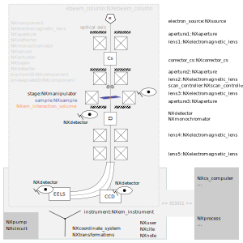

.. _Em-Structure:

=======================
Electron microscopy
=======================

.. index::
   Design
   EmAppDef
   EmBC
   
.. _EmDesign:

Design
######

NXem provides support for documenting research with scanning electron microscopes (SEM), scanning electron microscopes that are equipped with
focused-ion beam (FIB) capabilities, and transmission respectively scanning transmission electron microscopy (TEM and STEM).
The actual design of the electron-optical beam path and individual components used differ often substantially.
Therefore, NXem allows to describe an arbitrary number of components. These modular building blocks are
realized via using instances of base classes which offer concepts that are specific for electron microscopy.

The following three figures provide one schematic example for each respective type of instrument. Specifically, how the concepts of NXem
can be used to describe each instrument. All figures are meant for illustrative and educational purposes. The figures build up complexity
successively starting with the simpler case of a SEM (Fig. 1), moving to a SEM with FIB capabilities (Fig. 2), arriving at
a (S)TEM (Fig. 3). The capabilities that are illustrated for the SEM in Fig. 1 are also offered for all further cases but not
always repeated in Figs. 2 and 3 for the sake of conciseness. The examples take the perspective of typical users who are
interested in reporting the metadata and data that have been collected during a session with the microscope: 

.. image:: NXem.TopLevelDoc.SEM.svg
    :width: 100%

**Fig. 1** - an example for a SEM
The instrument is constructed from a so-called column, a housing for all technical components such as the electron source,
the lenses, like here shown a condenser and an objective lens, respective apertures, and further components, like a stigmator
to correct for axial image distortions. The trajectory of the electron beam along the optical axis is simplified for
illustrative purposes. In summary, the sample is illuminated by an electron beam that is guided along the optical axis
through and past a set of components. A scan controller is used to deflect this beam to illuminate specific locations
on the sample surface. In response to the electron-beam sample interaction and interaction volume is formed.
Different types of signals are generated that are picked up by different types of detectors. Three detectors
are shown as an example. Apart from the column, a SEM has further components. The base classes that are used for
modeling these are listed in the lower part of the figure. These document pumps and other hardware, assumptions made
such as frames of references and transformations between these frames, and the computing hardware and software tools
that are used for controlling the SEM and all its connected components. Using an electron microscope demands
processing of data. These processing steps are modeled with instances of the NXprocess base class.
Method-specific base classes are provided that inherit from NXprocess. These are used for documenting
the parameterization, the results, and sequence of such steps. Examples of method-specific base classes
are NXem_ebsd for electron backscatter diffraction, NXem_eds for energy-dispersive X-ray spectroscopy, NXem_img
for different imaging modes and NXem_eels for electron energy loss spectroscopy.

.. image:: NXem.TopLevelDoc.FIB.svg
    :width: 100%

**Fig. 2** - an example for a SEM with plasma FIB capabilities
Adding or flanging another column to an electron microscope equips it with focused-ion beam capabilities.
The design of this ibeam_column follows the design of the ebeam_column, a housing with technical components, such as
the ion source, lenses, apertures, beam distortion and beam shaping components, and an own scan controller
for guiding the ion beam towards the sample surface. Like in Fig. 1 the trajectory of the ion beam is simplified.

**Fig. 3** an example for a (S)TEM
The design principles for the SEM as well as the FIB are used for modeling a transmission electron microscope.
Noteworthy is that the figure illustrates an optical setup that is a mixture of a conventional TEM and a STEM.
The presence of a scan_controller is one characteristic feature of an STEM. Given that a TEM specimen is typically
orders of magnitude thinner than a SEM specimen, the electron beam can penetrate the material. This enables
investing additional imaging modes and probing other characteristic electron-matter interactions the most
prominent of which electron energy loss spectroscopy. Consequently, additional lens and components are introduced
into the beam path of the exiting electrons.

.. _EmAppDef:

Application Definition
######################
An experiment with an electron microscope proceeds as follows: users place a sample into the microscope, calibrate the instrument,
take measurements, may prepare their specimens with a focused ion beam, calibrate again, and take further measurements,
they process data, until eventually their session on the instrument ends. In between, virtually all of these steps data
are collected and stream in from different detectors. Each detector probes different physical mechanisms
of the interaction between electrons or other types of radiation with the specimen. A microscope session ends with the scientist
removing the specimen from the instrument or parking it so that the next user can start a session.
Occasionally, service technicians perform calibrations and maintenance which also can be described as a session on the microscope.
We have provided base classes to describe these steps and events and an application definition for electron microscopy.

A simulation of an electron microscope or of electron beam matter interaction takes a simpler perspective on many of these
practical aspects. Typically an electron-optical setup and material is defined, assumptions about the properties and trajectory
of the electron beam are made or simulated. The simulation analyzes the interaction volume by inspecting e.g. the trajectories of
individual electrons or by modeling their collective behavior via computing numerical solutions or approximations for the
beam electro-magnetic field.

    :ref:`NXem`:
        A general application definition which explores the possibilities of electron microscopes for characterizing
        electron- and ion-beam matter interactions.

.. _EmBC:

Base Classes
############

The design of NXem uses several existent base class and adds edits and additions of some concepts to make these base classes applicable for the field of electron microscopy (:ref:`NXactuator`, :ref:`NXaperture`, :ref:`NXbeam`, :ref:`NXcite`, :ref:`NXcollection`, :ref:`NXcomponent`, :ref:`NXcoordinate_system`, :ref:`NXdata`,
:ref:`NXdeflector`, :ref:`NXdetector`, :ref:`NXfabrication`, :ref:`NXmanipulator`, :ref:`NXmonochromator`, :ref:`NXnote`, :ref:`NXparameters`, :ref:`NXprocess`,
:ref:`NXsample`, :ref:`NXsensor`, :ref:`NXsource`, and :ref:`NXuser`).

Many design decisions of the application definitions :ref:`NXem` and :ref:`NXapm` are aligned. Examples are the use of base classes for instrument-specific
events :ref:`NXem_event_data`, the grouping of measurements :ref:`NXem_measurement` and simulations :ref:`NXem_simulation`, and the encapsulating of :ref:`NXparameters` and :ref:`NXdata` in :ref:`NXprocess` instances to describe workflows of processing. The base classes :ref:`NXatom`, :ref:`NXunit_cell`, and :ref:`NXphase` were introduced to document sets of atoms, the spatial arrangement of atoms, and offer concepts for documenting when
regions-of-interest in a material represent thermodynamic phases.

In addition to these considerations, several base classes were proposed to define concepts that are specific for electron microscopy:

    :ref:`NXaberration`:
        A base class to describe procedures and values for the calibration of aberrations.

    :ref:`NXcorrector_cs`:
        A base class to describe a corrective lens or compound lens sets to reduce the aberration of an electron beam.

    :ref:`NXebeam_column`:
        A base class to group the components relevant for generating and shaping an electron beam.
    
    :ref:`NXibeam_column`:
        A base class to group the components relevant for generating and shaping an ion beam.

    :ref:`NXimage`:
        A base class to store individual images or stacks of images.
        
    :ref:`NXem_instrument`:
        A base class to document all components that make up an instrument (real or simulated) when using it for studying
        electron matter interaction. This base class is used in NXem in two places:
        Firstly, inside an ENTRY/measurement/instrument group. This group holds all those (meta)data which do not change
        during a session, i.e. instrument name, typically identifier of hardware components or version of control software.
        Secondly, inside ENTRY/measurement/eventID groups; these hold all those (meta)data data that change during a session.

    :ref:`NXem_event_data`:
        A base class representing a container to hold time-stamped and instrument-specific-state-
        annotated data during a session at an electron microscope.

    :ref:`NXroi_process` and specialization :ref:`NXem_interaction_volume`:
        A base class to document the region-of-interest within an area or volume of material.
        The region of material where the electron beam interacts with the sample is called the interaction volume.  
        
    :ref:`NXelectromagnetic_lens`:
        A base class to describe an electro-magnetic lens. In practice, an electron microscope has many such lenses.
        It is possible to specify as many lenses as necessary to represent eventually each single lens of the microscope
        and thus describe how the lenses are affecting the electron beam. This can offer opportunities for developers of
        software tools which strive to model the instrument e.g. to create digital twins of the instrument.
        We understand there is still a way to go with this to arrive there though.

    :ref:`NXem_optical_system`:
        A base class to store for now qualitative and quantitative values of frequent interest
        which are affected by the interplay of the components and state of an electron microscope.
        Examples are the semiconvergence angle, the magnification, or the camera length.

    :ref:`NXpump`:
        A base class to describe details about a pump in an instrument.

    :ref:`NXscan_controller`:
        A base class to represent a component that is used to deflect a beam of charged particles in a controlled manner.
        This can be used to document the scan pattern.

    :ref:`NXspectrum`:
        A base class to store individual spectra and stacks of spectra.
        
Method-specific concepts and their usage in application definitions
###################################################################

It became clear during the design of the electron-microscopy-specific additions to NeXus that many data and metadata which are relevant for
a given experiment have usually only few connections to the detailed description of the instrument. Instead, these are steps of
data analysis and data processing workflows. This motivated a granularization of these concepts into own method-specific base classes:

    :ref:`NXem_ebsd`, :ref:`NXem_eds`, :ref:`NXem_eels`, :ref:`NXem_img`:
        These base classes provide concepts for specific data acquisition modes and associated analysis as are used in electron microscopy
        such as for collecting and indexing Kikuchi diffraction patterns into orientation maps for two-dimensional, three-dimensional point
        cloud data, reporting X-ray spectroscopy, different imaging modes, or documenting electron energy loss spectroscopy (EELS).
        A substantial further number of such base class could be designed that can build on the ideas and principles that are
        suggested via these four base classes.
