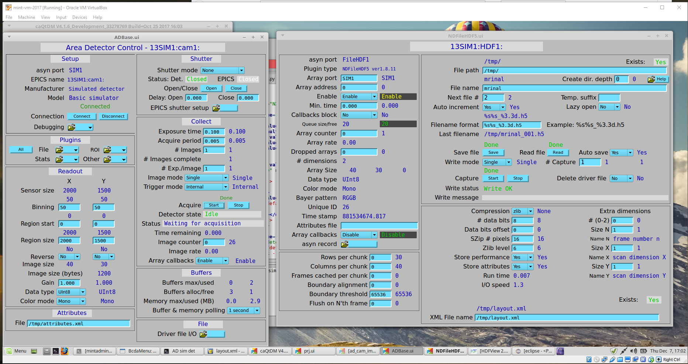
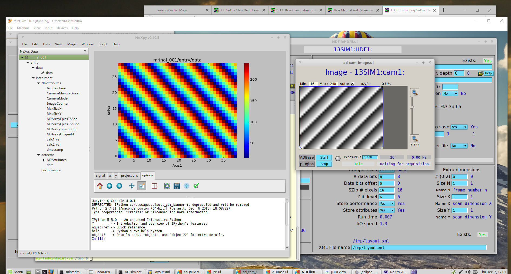

.. index:: !EPICS; examples

.. _EPICS_Area_Detector.examples.HDF5:

EPICS Area Detector Examples
############################

Two examples in this section show how to write NeXus HDF5 data files 
with EPICS Area Detector images.  
The first shows how to configure the HDF5 File Writing Plugin
of the EPICS Area Detector software.

The second example shows how to write an EPICS Area Detector image
using Python.

HDF5 File Writing Plugin
************************

This example  describes how to write a NeXus HDF5 data file
using the EPICS [#]_ Area Detector [#]_ HDF5 file writing plugin [#]_.
We will use the EPICS SimDetector [#]_ as an example.
(PV prefix: ``13SIM1:``)  
(Replace that with the prefix for your detector's IOC.)

One data file will be produced for each image generated by EPICS.

You'll need AreaDetector version 2.5 or higher to use this
as the procedures for using the HDF5 file writing plugin 
changed with this release.

configuration files
===================

There are two configuration files we must edit 
to configure an EPICS AreaDetector 
to write NeXus files using the HDF5 File Writer plugin:

===================  ====================================
file                 description
===================  ====================================
``attributes.xml``   what information to know about from EPICS and other sources
``layout.xml``       where to write that information in the HDF5 file
===================  ====================================

Put these files into a known directory where your EPICS IOC can find them.

``attributes.xml``
******************

The attributes file is easy to edit but requires a wide screen.  
Any text editor will do.  

.. note:: The attributes file shown here has been reformatted 
   for display in this manual.  The *downloads* section below
   provides an attributes file with the same content
   using its wide formatting (one complete Attribute per line).
   Either version of this file is acceptable.

.. literalinclude:: attributes-reformatted.xml
   :tab-width: 4
   :linenos:
   :language: guess

If you want to add PVs to be written in the HDF5 file, 
replicate the ``calc1_val`` line.  There is one additional attribute you can use.   
The attribute ``when`` (*Event when the attribute data is updated*) can take 
any of these values:  ``OnFileOpen``, ``OnFileClose``, ``OnFileWrite``

Such as::

    <Attribute 
       name="calc1_val"
      type="EPICS_PV"
      source="prj:userCalc1.VAL"
      datatype="DBR_NATIVE"
      description="some calculation result"
      when="OnFileWrite"/>

``layout.xml``
**************

You might not need to edit the layout file.  
It will be fine (at least a good starting point) as it is, 
even if you add PVs to the attributes.xml file.

.. literalinclude:: layout.xml
   :tab-width: 4
   :linenos:
   :language: guess

additional configuration
========================

Additional configurations of the EPICS Area Detector and the HDF5 File Plugin
are done using the EPICS screens (shown here using caQtDM [#]_):

   
   **ADBase** and **NDFileHDF5** configuration screens
   

Additional configuration on the **ADBase** screen:

* Set *Image mode* to "Single"
* Set *Exposure time* as you wish
* Set *# Images* to 1
* for testing, it is common to bin the data to reduce the image size
* The full path to the ``attributes.xml`` file goes in the bottom/left **File** box

Additional configuration on the **NDFileHDF5** screen:

* Set the **File path** and "File name" to your choice.
* Set **Auto save** to "Yes".
* Set **Compression** to "zlib" if you wish (optional)
* Set **Enable** to "Enable" or the HDF5 plugin won't get images to write!
* Set **Callbacks block** to "Yes" if you want to wait for HDF5 files to finish writing before collecting the next image
* The full path to the ``layout.xml`` file goes into the bottom/right **XML File name** box
* Leave the **Attributes file** box empty in this screen.

When you enter the names of these files in the configuration screen 
boxes, AreaDetector will check the files for errors and let you know.

Example view
============

We collected data for one image, ``/tmp/mrinal_001.h5``, in the 
HDF5 file provided in the **downloads** section.  
You may notice that the values for ``calc1_val`` and ``calc2_val`` 
were arrays rather than single values.  That was due to an error in the original 
``attributes.xml`` file, which had ``type="PARAM"`` instead of ``type="EPICS_PV"``.
This has been fixed in the ``attributes.xml`` file presented here.

.. _EPICS_Area_Detector.examples.python:

Python code to store an image in a NeXus file
*********************************************

Suppose you want to write area detector images into NeXus HDF5 
files python code.  Let's assume 
you have the image already in memory in a numpy array, perhaps from 
reading a TIFF file or from an EPICS PV using PyEpics.  The file 
``write_nexus_file.py`` (provided below) reads an image from the sim 
detector and writes it to a NeXus HDF5 data file, along with some 
additional metadata.  

.. literalinclude:: write_nexus_file.py
   :tab-width: 4
   :linenos:
   :language: guess

The output from that code is given in the 
example.h5 file.  It has this tree structure:

.. literalinclude:: tree_structure.txt
   :tab-width: 4
   :linenos:
   :language: guess

Visualization
*************

You can visualize the HDF5 files with several programs, such as:
hdfview [#]_, nexpy [#]_, or pymca [#]_.  
Views of the image shown using **NeXPy** (from the HDF5 file) 
and **caQtDM** (the image from EPICS) are shown.

   
   Views of the image in **NeXPy** (left) and in **caQtDM** (right)

Get the installation instructions for any of these programs 
from a web search.  Other 
data analysis programs such as MatLab, IgorPro, and IDL can 
also read HDF5 files but you might have to work a bit more to 
get the data to a plot.

Downloads
*********

================================ ============================================================
file                             description
================================ ============================================================
:download:`attributes.xml`       The attributes file
:download:`layout.xml`           The layout file
:download:`mrinal_001.h5`        example NeXus HDF5 file written from EPICS
:download:`write_nexus_file.py`  Python code to get images from EPICS and write a NeXus file
:download:`example.h5`           example NeXus HDF5 file written from Python
================================ ============================================================

Footnotes
*********

.. [#] EPICS: http://www.aps.anl.gov/epics/
.. [#] EPICS Area Detector: http://cars9.uchicago.edu/software/epics/areaDetector.html
.. [#] HDF5 File Writer: http://cars9.uchicago.edu/software/epics/NDFileHDF5.html
.. [#] EPICS SimDetector: http://cars9.uchicago.edu/software/epics/simDetectorDoc.html
.. [#] caQtDM: http://epics.web.psi.ch/software/caqtdm/
.. [#] hdfview: https://support.hdfgroup.org/products/java/hdfview/
.. [#] nexpy: https://nexpy.github.io/nexpy/
.. [#] pymca: http://pymca.sourceforge.net/
