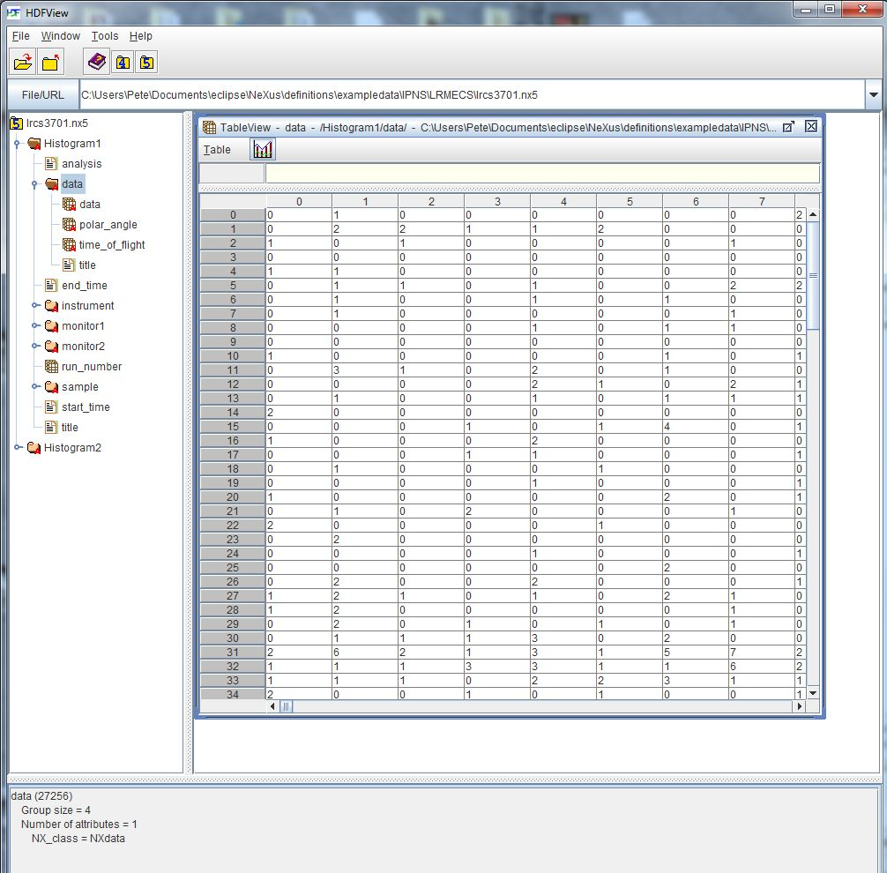

.. _Example-Viewing-LRMECS-Data:

Viewing 2-D Data from LRMECS
############################

The IPNS LRMECS instrument stored data in NeXus HDF4 data files.  
One such example is available from the repository of NeXus data 
file examples. [#]_
For this example, we will start with a conversion of that 
original data file into *HDF5* format.

======  =============
format  file name
======  =============
HDF4    lrcs3701.nxs
HDF5    lrcs3701.nx5
======  ============= 

This dataset contains two histograms with 2-D images (148x750 and 148x32) of 32-bit integers.
First, we use the ``h5dump`` tool to investigate the header content of the file 
(not showing any of the data).

.. [#] LRMECS example data: https://github.com/nexusformat/exampledata/tree/master/IPNS/LRMECS

Visualize Using ``h5dump``
**************************

Here, the output of the command::

	h5dump -H lrcs3701.nx5

has been edited to only show the first *NXdata* group (``/Histogram1/data``):

LRMECS ``lrcs3701`` data: ``h5dump`` output
===========================================

.. literalinclude:: dump-histogram1-data.txt
    :tab-width: 4
    :linenos:
    :language: text

Visualize Using *HDFview*
*************************

For many, the simplest way to view the data content 
of an HDF5 file is to use the  *HDFview* program 
(https://portal.hdfgroup.org/display/HDFVIEW/HDFView)
from The HDF Group.  After starting *HDFview*, the data file 
may be loaded by dragging it into the main HDF window.
On opening up to the first ``NXdata`` group */Histogram1/data*
(as above), and then double-clicking the dataset called: *data*, we get
our first view of the data.

    LRMECS ``lrcs3701`` data: *HDFview*

The data may be represented as an image by accessing the *Open As*
menu from HDFview (on Windows, right click the dataset called *data*
and select the *Open As* item, consult the HDFview documentation 
for different platform instructions).  Be sure to select the *Image* 
radio button, and then (accepting everything else as a default) press the
*Ok* button.

.. note:: In this image, dark represents low intensity 
			while white represents high intensity.

.. figure:: hdfview-open-as.jpg
    :width: 80%

    LRMECS ``lrcs3701`` data: *HDFview* *Open As* dialog

LRMECS ``lrcs3701`` data: image
===============================

.. figure:: hdfview-image.jpg
    :width: 80%

    LRMECS ``lrcs3701`` data: *HDFview* Image

Visualize Using *IgorPro*
*************************

Another way to visualize this data is to use a commercial 
package for scientific data visualization and analysis.  
One such package is *IgorPro* from http://www.wavemetrics.com

IgorPro provides a browser for HDF5 files that can open our 
NeXus HDF5 and display the image.  Follow the instructions 
from WaveMetrics to install the *HDF5 Browser* package:  
http://www.wavemetrics.com/products/igorpro/dataaccess/hdf5.htm

You may not have to do this step if you have already installed the *HDF5 Browser*.
IgorPro will tell you if it is not installed properly.
To install the *HDF5 Browser*, first start *IgorPro*.
Next, select from the menus and submenus: 
``Data; Load Waves; Packages; Install HDF5 Package`` as shown in the next figure.
IgorPro may direct you to perform more activities before you progress from this step.

.. figure:: igor-install-hdf5-package.jpg
    :width: 80%

    LRMECS ``lrcs3701`` data: *IgorPro* install HDF5 Browser

Next, open the *HDF5 Browser* by selecting from 
the menus and submenus:  
``Data; Load Waves; New HDF5 Browser`` 
as shown in the next figure.

.. figure:: igor-menu-selection.jpg
    :width: 80%

    LRMECS ``lrcs3701`` data: *IgorPro* *HDFBrowser* dialog

Next, click the *Open HDF5 File* button and 
open the NeXus HDF5 file ``lrcs3701.nxs``.  In the lower left *Groups*
panel, click the *data* dataset.  Also, under the panel
on the right called *Load Dataset Options*,
choose ``No Table`` as shown.  Finally, click the 
*Load Dataset* button (in the *Datasets* group) 
to display the image.

.. note:: In this image, dark represents low intensity 
	      while white represents high intensity.  The image has 
	      been rotated for easier representation in this manual.

.. figure:: Igor-HDFBrowser-demo.jpg
    :width: 80%

    LRMECS ``lrcs3701`` data: *IgorPro* *HDFBrowser* dialog

LRMECS ``lrcs3701`` data: image
===============================

.. figure:: igor-data.jpg
    :width: 80%

    LRMECS ``lrcs3701`` data: *IgorPro* Image
