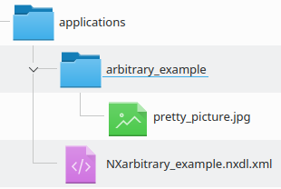

======================
NXDL File Organisation
======================

NXDL File Name
##############

In order for the XML machinery to find and link the code in the various files, the name of the file must be composed of the definition name (matching both the spelling and the case) and a ".nxdl.xml" extension. For example, the base class ``NXarbitrary_example`` should be defined by NXDL code within the ``NXarbitrary_example.nxdl.xml`` file. Note also that the definition name is stated twice in application definitions, once in the ``definition`` tag, and again as the value of an ``item`` contained within the ``field`` tag that is named "definition".

.. code-block:: xml
   :caption: NXarbitrary_example.nxdl.xml
   
   <definition name="NXarbitrary_example">
   
   <!-- later -->
   
      <field name="definition">
         <doc>Official NeXus NXDL schema to which this file conforms.</doc>
         <enumeration>
            <item value="NXarbitrary_example"/>                
         </enumeration>
      </field>
   </definition>

Documentation Images
####################

Including images (or other related content) in the documentation of NXDL definitions can be very effective for communicating how different parts of the definition interact. To be properly included in the compilation of the NeXus documentation, the extra files must go into a directory having the same name as the definition without the NX prefix.
For example, if the ``NXarbitrary_example`` base class has a ``pretty_picture.jpg`` image included in its documentation, then the image file should be located by the path (relative to ``NXarbitrary_example.xml``) ``arbitrary_example/pretty_picture.jpg``.

