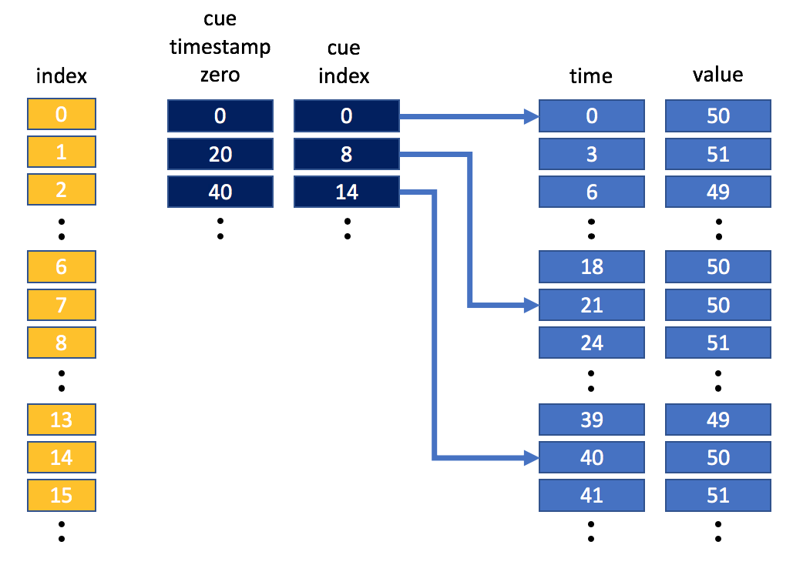

.. _Strategies:

======================================================
Strategies for storing information in NeXus data files
======================================================

NeXus may appear daunting, at first, to use.  The number of base classes
is quite large as well as is the number of application definitions.  This chapter
describes some of the strategies that have been recommended for
:index:`how to store <strategies>` information in NeXus data files.

When we use the term *storing*, some might be helped if they consider
this as descriptions for how to *classify* their data.

It is intended for this chapter to grow, with the addition of different use cases
as they are presented for suggestions.

..  +++++++++++++++ The simplest case +++++++++++++++++++

.. _Strategies-simplest:

Strategies: The simplest case(s)
################################

Perhaps the :index:`simplest case <strategies; simplest case(s)>`
might be either a step scan with two or more
columns of data.  Another simple case might be a single image acquired
by an area detector.  In either of these hypothetical
cases, the situation is so simple
that there is little addition information available to be described
(for whatever reason).

Step scan with two or more data columns
=======================================

Consider the case where we wish to store the data from a step scan.
This case may involve two or more *related*
1-D arrays of data to be saved, each
having the same length. For our hypothetical case, we'lll
have these positioners as arrays and assume that a default plot of
*photodiode* vs. *ar*:

======================   ====================================================
positioner arrays        detector arrays
======================   ====================================================
``ar``, ``ay``, ``dy``   ``I0``, ``I00``, ``time``, ``Epoch``, ``photodiode``
======================   ====================================================

.. compound::

   .. rubric:: Data file structure for 
      *Step scan with two or more data columns*

   .. code-block:: text
      :linenos:

      file.nxs: NeXus HDF5 data file
         @default = "entry"
         entry: NXentry
            @NX_class = "NXentry"
            @default = "data"
            data: NXdata
               @NX_class = "NXdata"
               @signal = "photodiode"
               @axes = "ar"
               ar: NX_FLOAT[]
               ay: NX_FLOAT[]
               dy: NX_FLOAT[]
               I0: NX_FLOAT[]
               I00: NX_FLOAT[]
               time: NX_FLOAT[]
               Epoch: NX_FLOAT[]
               photodiode: NX_FLOAT[]

..  +++++++++++++++ The next case +++++++++++++++++++

..  TODO ideas for more cases:
    simple instrument, no application definition
    simple instrument, with application definition
    instrument with multiple detectors, no application definition
    instrument with multiple detectors, with application definition
    instrument with multiple, simultaneous application definitions
    instrument with rapidly changing needs

.. _Strategies-wavelength:
	
Strategies: The wavelength
##########################

*Where should the wavelength of my experiment be written?*
This is one of the :ref:`FAQ`.
The canonical location to store wavelength has been::

	/NXentry/NXinstrument/NXcrystal/wavelength

.. compound::

   .. rubric:: Partial data file structure for 
      *canonical location to store wavelength*

   .. code-block:: text
      :linenos:

      entry: NXentry
         @NX_class = NXentry
         instrument: NXinstrument
            @NX_class = NXinstrument
            crystal: NXcrystal
               @NX_class = NXcrystal
               wavelength: NX_FLOAT

More recently, this location makes more sense to many::

	/NXentry/NXinstrument/NXmonochromator/wavelength

.. compound::

   .. rubric:: Partial data file structure for 
      *location which makes more sense to many* to store wavelength

   .. code-block:: text
      :linenos:

      entry: NXentry
         @NX_class = NXentry
         instrument: NXinstrument
            @NX_class = NXinstrument
            monochromator: NXmonochromator
               @NX_class = NXmonochromator
               wavelength: NX_FLOAT

:ref:`NXcrystal` describes a crystal monochromator or analyzer.
Recently, scientists with monochromatic radiation not defined by a crystal,
such as from an electron-beam undulator or a neutron helical velocity
selector, were not satisfied with creating a fictitious instance of a
crystal just to preserve the wavelength from their instrument.
Thus, the addition of the :ref:`NXmonochromator` base class to NeXus, 
which also allows "energy" to be specified if one is so inclined.

.. note:: See the :ref:`preface.Class.path.specification` section 
	for a short discussion of the difference between the HDF5 path 
	and the NeXus symbolic class path.

.. _Strategies-timestamped:
	
Strategies: Time-stamped data
#############################
*How should I store time-stamped data?*

Time-stamped data can be stored in either :ref:`NXlog` and :ref:`NXevent_data` structures. 
Of the two, :ref:`NXlog` is the most important one, :ref:`NXevent_data` is normally only used for storing detector 
time of flight event data 
and :ref:`NXlog` would be used for storing any other time-stamped data, e.g. sample temperature, chopper top-dead-centre, 
motor position, detector images etc.

Regarding the NeXus file structure to use, there is one simple rule: just use the standard NeXus file structure but insert/replace 
the fields for streamed data elements through :ref:`NXlog` or :ref:`NXevent_data` structures. For example, consider the 
collection of detector images against a change in the magnetic field on the sample. Then, both NXsample/magnetic_field and 
NXdetector/data would be :ref:`NXlog` structures containing the time stamped data. 

Both :ref:`NXlog` and :ref:`NXevent_data` have additional support for storing time-stamped 
data in the form of cues; cues can be used to place markers in the data that allow one to 
quickly look up coarse time ranges of interest. This coarse range of data can then be manually 
trimmed to be more selective, if required.
The application writing the NeXus file is responsible for writing cues and when they are written. 
For example, the cue could be written every 10 seconds, every pulse, every 100 datapoints and so on.

Let's consider the case where NXlog is being used to store sample temperature data that has been 
sampled once every three seconds. The application that wrote the data has added cues every 20 
seconds. Pictorially, this may look something like this:

If we wanted to retrieve the mean temperature between 30 and 40 seconds, we would use the cues 
to grab the data between 20 seconds and 40 seconds, and then trim that data to get the data we 
want.
Obviously in this simple example this does not gain us a lot, but it is easy to see that in a 
large dataset having appropriately placed cues can save significant computational time when looking 
up values in a certain time-stamp range. NeXus has actually borrowed the cueing table concept 
from video file formats where it allows viewing software to quickly access your favourite scene. 
Correspondingly, cueing in NeXus allows you to quickly access your favourite morsel of time stamped 
data.  

In the NeXus Features repository, the feature `ECB064453EDB096D <https://github.com/nexusformat/features/tree/b0f4862f267844a3f66efa701953e684978b0959/src/recipes/ECB064453EDB096D>`_ 
shows example code that uses cues to select time-stamped data.

Strategies: The next case
#########################
	
	.. this section was new in 2010-10, we are gathering and adding historical cases ...

The :ref:`NIAC` welcomes suggestions for additional sections in this chapter.

.. TODO: There are some strategies listed elsewhere in the manual.  Find them and cross-reference here.
