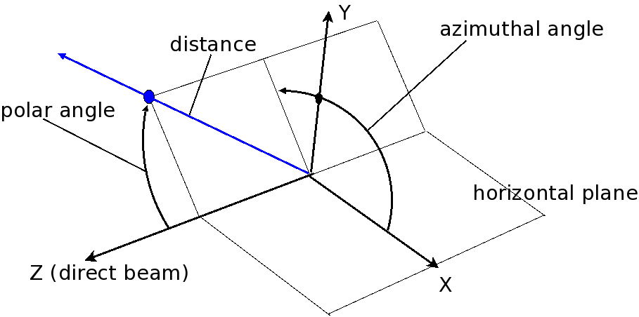

.. $Id$

..  _NeXus-Design:

***************************************************************************
NeXus Design
***************************************************************************

.. ! index:: 

This chapter actually defines the rules to use for 
writing valid NeXus files. An explanation of NeXus objects 
is followed by the definition of NeXus coordinate systems, 
the rules for structuring files and the rules for 
storing single items of data.  

.. index:: hierarchy
.. index:: data objects; fields

.. sidebar:: Note

   In this manual, we use the terms *field*, *data field*, and 
   *data item* synonymously to be consistent
   with their meaning between NeXus data file instances and 
   NXDL specification files.

The structure of NeXus files is extremely flexible, 
allowing the storage both of simple data sets, such as a 
single data array and its axes, and also of highly complex 
data, such as the simulation results or an entire 
multi-component instrument. This flexibility is a necessity 
as NeXus strives to capture data from a wild variety of 
applications in x-ray, muSR and neutron scattering. The 
flexibility is achieved through a hierarchical 
structure, with related *fields* 
collected together into *groups*, 
making NeXus files easy to navigate, even without any
documentation. NeXus files are self-describing, and 
should be easy to understand, at
least by those familiar with the experimental technique.

.. _Design-Objects:

=====================================================================
NeXus Objects and Terms
=====================================================================

Before discussing the design of NeXus in greater detail 
it is necessary to define the objects and terms 
used by NeXus. These are:

*Groups*
    Group data fields and other groups together. 
    Groups represent levels in the NeXus hierarchy

*Data fields*
    Multidimensional arrays and scalars 
    representing the actual data to be stored

*Attributes*
    Additional metadata which can be assigned 
    to groups or data fields

*Links*
    Elements which point to data stored in 
    another place in the file hierarchy

*NeXus Classes*
    Dictionaries of names possible in the 
    various types of NeXus groups

*Application Definitions*
    Describe the content of a NeXus file 
    for a particular usage case

In the following sections these elements of 
NeXus files will be defined in more detail. 

.. _Design-Groups:

Data Groups
++++++++++++++++++++++++++++++++++++++++++++++++

.. index:: data objects; groups
.. index:: hierarchy
.. index:: rules; HDF

NeXus files consist of data groups,
which contain fields and/or other
groups to form a hierarchical structure.
This hierarchy is designed to make it
easy to navigate a NeXus file by storing related fields together. Data
groups are identified both by a name, which must be unique within a particular
group, and a class. There can be multiple groups with the same class
but they must have different names (based on the HDF rules).
For the class names used with NeXus data groups 
the prefix `NX` is reserved. Thus all NeXus class 
names start with `NX`.

.. _Design-Fields:

Data Fields
++++++++++++++++++++++++++++++++++++++++++++++++

.. index:: data objects; fields
.. index:: data objects; data items

Data fields
contain the essential information stored in a NeXus file. They can
be scalar values or multidimensional arrays of a variety of sizes (1-byte,
2-byte, 4-byte, 8-byte) and types (integers, floats, characters). The fields may
store both experimental results (counts, detector angles, etc), and other
information associated with the experiment (start and end times, user names,
etc). Data fields are identified by their names, which must be unique within the
group in which they are stored.

.. _Design-Attributes:

Data Attributes
++++++++++++++++++++++++++++++++++++++++++++++++

.. index:: data objects; attributes
.. index:: units
.. index:: NeXus basic motivation; default plot
.. index:: data objects; attributes; global

Attributes 
are extra (meta-)information that are associated with particular
fields. They are used to annotate the data, for example with physical units
or calibration offsets, and may be scalar numbers or character
strings. NeXus also uses attributes to identify plottable data
and their axes, etc. 
A description of possible attributes can be found 
in the table titled :ref:`table.ExampleAttributes`.
Finally, NeXus files themselves have global 
attributes which are listed in the :ref:`table.GlobalAttributes` table
that identify the NeXus version, file creation time, etc. 
Attributes are identified by their
names, which must be unique in each field.

.. _table.ExampleAttributes:

NeXus Data Attributes
---------------------------------

For the full specification of attributes, 
see :ref:`volume2.NXDL.section`.

=================== ========== =========================================
Name                Type       Description
=================== ========== =========================================
units               NX_CHAR    Data units, given as character strings, 
			       must conform to the NeXus units standard. 
			       See the "NeXus units" section 
			       for details.
signal              NX_INT     Defines which data set contains the 
			       signal to be plotted use `signal="1"`
			       for main signal
axes                NX_CHAR    Defines the names of the dimension 
			       scales for this data set as a 
			       colon-delimited list. For example, 
			       suppose data is an array with elements 
			       `data[j][i]` (C) 
			       or `data(i,j)` (Fortran), with 
			       dimension scales `time_of_flight[i]` 
			       and `polar_angle[j]`, then data would 
			       have an attribute 
			       `axes="polar_angle:time_of_flight"`
			       in addition to an attribute 
			       `signal="1"`.
axis                NX_INT     The original way of designating data 
			       for plotting, now superceded by the 
			       axes attribute. This defines the rank 
			       of the signal data for which this data 
			       set is a dimension scale in order of 
			       the fastest varying index (see a longer 
			       discussion in the section on NXdata 
			       :ref:`NXdata-structure`
			       structure), 
			       i.e. if the array being stored is data, 
			       with elements `data[j][i]` in C and 
			       `data(i,j)` in Fortran, axis would 
			       have the following values: 
			       ith dimension (`axis="1"`), 
			       jth dimension (`axis="2"`), etc.
primary             NX_INT32   Defines the order of preference for 
			       dimension scales which apply to the 
			       same rank of signal data. Use 
			       `primary="1"` to indicate preferred 
			       dimension scale
long_name           NX_CHAR    Defines title of signal data or 
			       axis label of dimension scale
calibration_status  NX_CHAR    Defines status of data value. 
			       Set to "Nominal" or "Measured"
offset              NX_INT     Rank values off offsets to use for 
			       each dimension if the data is not in 
			       C storage order
stride              NX_INT     Rank values of steps to use when 
			       incrementing the dimension
transformation_type NX_CHAR    translation or totation
vector              NX_FLOAT   3 values describing the axis of 
			       rotation or the direction of translation
interpretation      NX_CHAR    Describes how to display the data. 
			       Allowed values include: 
			       scaler (0-D data), 
			       spectrum (1-D data), 
			       image (2-D data), 
			       or vertex (3-D data). 
=================== ========== =========================================

.. _table.GlobalAttributes:

NeXus File Global Attributes
-----------------------------------

================= ========== =========================================
Name              Type       Description
================= ========== =========================================
file_name         NX_CHAR    File name of original NeXus file to 
                             assist in identification if the external 
			     name has been changed
file_time         ISO 8601   Date and time of file creation
file_update_time  ISO 8601   Date and time of last file change 
			     at close
NeXus_version     NX_CHAR    Version of NeXus API used in writing 
			     the file
creator           NX_CHAR    Facility or program where the file 
			     originated
================= ========== =========================================

.. _Design-Links:

Data Links
++++++++++++++++++++++++++++++++++++++++++++++++

.. index:: link
.. index:: target, link

Links are pointers to existing data somewhere else. 
The concept is very much like 
symbolic links in a unix filesystem.
The NeXus definition sometimes requires  
access to the same data in different groups 
within the same file. 
For example: detector data is stored in the 
``NXinstrument/NXdetector`` group 
but may be needed in ``NXdata`` for automatic plotting. 
Rather then replicating the data, NeXus uses 
links in such situations. See the figure :ref:`fig.data-linking` for 
a more descriptive representation of the concept of linking. 

.. _fig.data-linking:

Linking in a NeXus file.
-----------------------------------

.. figure:: ../../../manual/img/data-linking.png
	:width: 400 pt

	Linking in a NeXus file.
	See example code below: :ref:`example.data-linking`

.. _Design-NeXusClasses:

NeXus Base Classes
++++++++++++++++++++++++++++++++++++++++++++++++

.. index:: NXDL
.. index:: rules; naming

Data groups often describe objects in the experiment (monitors, detectors,
monochromators, etc.), so that the contents (both data fields and/or other data
groups) comprise the properties of that object. NeXus has defined a set of standard
objects, or base classes, out of which a NeXus file can be constructed. This is each data group
is identified by a name and a class. The group class, defines the type of object
and the properties that it can contain, whereas the group name defines a unique instance
of that class. These classes are
defined in XML using the NeXus Definition Language (NXDL)
format. All NeXus class types adopted by the NIAC *must*
begin with `NX`.
Classes not adopted by the NIAC *must not*
start with `NX`.

.. index:: NeXus basic motivation; default plot

Not all classes define physical objects. Some refer to logical groupings of
experimental information, such as plottable data, 
sample environment logs, beam
profiles, etc.
There can be multiple instances of each class. On
the other hand, a typical NeXus file will only contain a small subset of the
possible classes.

NeXus base classes are not proper classes in the 
same sense as used in object oriented programming 
languages. In fact the use of the term classes is 
actually misleading but has established itself 
during the development of NeXus. NeXus base 
classes are rather dictionaries of field names 
and their meanings which are permitted in a 
particular NeXus group implementing the NeXus 
class. This sounds complicated but becomes easy 
if you consider that most NeXus groups describe 
instrument components. Then for example, a 
`NXmonochromator` base class describes all the 
possible field names which NeXus allows to be 
used to describe a monochromator.  

Most NeXus base classes represent instrument components. 
Some are used as containers to structure information in a 
file (`NXentry`, `NXcollection`, `NXinstrument`, 
`NXprocess`, `NXparameter`). But there are some base 
classes which have special uses which need to be 
mentioned here:

`NXdata`
    `NXdata` is used to identify the default plottable data. 
    The notion of a default plot of data is a basic 
    motivation of NeXus. 

`NXlog`
    `NXlog` is used to store time stamped data like the 
    log of a temperature controller. Basically you give 
    a start time, and arrays with a difference in seconds 
    to the start time and the values read. 

`NXnote`
    `NXnote` provides a place to store general notes, 
    images, video or whatever. A mime type is stored 
    together with a binary blob of data. Please use this 
    only for auxiliary information, for example an image 
    of your sample, or a photo of your boss. 

`NXgeometry`
    `NXgeometry` and its subgroups `NXtranslation`, 
    `NXorientation`, `NXshape` are used to store absolute 
    positions in the laboratory coordinate system or to 
    define shapes. 

These groups can appear anywhere in the NeXus hierarchy, 
where needed. Preferably close to the component they 
annotate or in a `NXcollection`. All of the base classes 
are documented in the reference manual. 

.. _NXdata-facilitates-TheDefaultPlot:

`NXdata` Facilitates Automatic Plotting
++++++++++++++++++++++++++++++++++++++++++++++++

.. index:: NeXus basic motivation; default plot
.. index:: automatic plotting, NeXus basic motivation, default plot
.. index:: dimension scale

The most notable special base class 
(also known as *group*) in NeXus is `NXdata`.  
`NXdata` is the answer to a basic motivation of NeXus 
to facilitate automatic plotting of data. 
`NXdata` is designed to contain the main dataset 
and its associated dimension scales (axes) of a 
NeXus data file. The usage scenario is that an 
automatic data plotting program just opens a 
`NXentry` and then continues to search for any 
`NXdata` groups. These `NXdata` groups represent 
the plottable data.  Here is the way an 
automatic plotting program ought to work:

1.  Search for NXentry groups

#.  Open an NXentry

#.  Search for NXdata groups

#.  Open an NXdata group

#.  Identify the plottable data.

  a.  Search for a dataset with attribute `signal=1`. 
      This is your main dataset. 
      (There should be only one dataset that matches.)

  #.  Try to read the axes attribute of the 
      main dataset, if it exists.

     i. The value of axes is a colon- or 
        comma-separated list of the datasets describing 
	the dimension scales 
	(such as `axes="polar_angle:time_of_flight"`).

     #. Parse axes and open the datasets to describe 
        your dimension scales 

  #.  If axes does not exist:

     i. Search for datasets with attributes 
        `axis=1`, `axis=2`, etc. 
	These are the datasets describing your axis. 
	There may be several datasets for any axis, 
	i.e. there may be multiple datasets with 
	the attribute `axis=1`. Among them the 
	dataset with the attribute `primary=1` is 
	the preferred one. All others are 
	alternative dimension scales.

     #. Open the datasets to describe 
        your dimension scales. 

#. Having found the default plottable data 
   and its dimension scales: make the plot

.. _Design-NeXusApplications:

NeXus Application Definitions
++++++++++++++++++++++++++++++++++++++++++++++++

The objects described so far provide us with the means to 
store data from a wide variety of instruments, simulations 
or processed data as resulting from data analysis. 
But NeXus strives to express strict standards for certain 
applications of NeXus too. The tool which NeXus uses for 
the expression of such strict standards is the NeXus 
Application Definition. A NeXus Application Definition 
describes which groups and data items have to be present 
in a file in order to properly describe an application 
of NeXus. For example for describing a powder diffraction 
experiment. Typically an application definition will contain 
only a small subset of the many groups and fields defined 
in NeXus. NeXus application definitions are also expressed 
in the NeXus Definition Language (NXDL). A tool exists which 
allows to validate a NeXus file against a given 
application definition.

Another way to look at a NeXus application definition 
is as a contract between a file writer and a file consumer 
(reader). A contract which reads: 
*If you write your files 
following a particular NeXus application definition, 
I can process these files with my software*.

Yet another way to look at a NeXus application definition 
is to understand it as an interface definition between data 
files and the software which uses this file. Much like an 
interface in the Java or other modern object oriented 
programming languages.

In contrast to NeXus base classes, NeXus supports inheritance 
in application definitions.

Please note that a NeXus Application Definition will only 
define the bare minimum of data necessary to perform common 
analysis with data. Practical files will nearly always 
contain more data. One of the beauties of NeXus is that it 
is always possible to add more data to a file without breaking 
its compliance with its application definition. 

.. _Design-CoordinateSystem:

NeXus Coordinate Systems
++++++++++++++++++++++++++++++++++++++++++++++++

.. index:: geometry
.. index:: McStas
.. index:: CIF

Coordinate systems in NeXus underwent quite some development. 
Initially, just positions of relevant motors were 
stored without further standardization. This soon proved to 
be too little and the *NeXus polar coordinate* system was 
developed. This system still is very close to angles 
meaningful to an instrument scientist but allows to define 
general positions of components easily. Then users from the 
simulation community approached the NeXus team and asked for 
a means to store absolute coordinates. This was implemented 
through the use of the `NXgeometry` class on top of the 
*McStas* [#McStas]_ 
system. We soon learned that all the things we do 
can be expressed through the McStas coordinate system. 
So the McStas coordinate system 
became the reference coordinate system for NeXus. 
`NXgeometry` was expanded to allow the description of shapes 
when the demand came up. 
Later members of the CIF [#CIF]_ team 
convinced the NeXus team of the beauty of transformation 
matrices and NeXus was enhanced to store the necessary 
information to fully map CIF concepts. Not much had to be 
changed though as we choose to document the existing angles 
in CIF terms. The CIF system allows to store arbitrary 
operations and nevertheless calculate absolute coordinates in 
the laboratory coordinate system. It also allows to convert 
from local, for example detector coordinate systems, to 
absolute coordinates in the laboratory system.

.. [#McStas] McStas, http://www.mcstas.org, also http://mcstas.risoe.dk
.. [#CIF] CIF (Crystallographic Information Framework), http://www.iucr.org/resources/cif

.. _Design-Coordinate-NXgeometry:

McStas and `NXgeometry` System
-----------------------------------------------

.. index:: geometry
.. index:: McStas

NeXus uses the *McStas coordinate system* [#McStas]_
as its laboratory coordinate system. 
The instrument is given a global, absolute coordinate system where:

* the *z* axis points in the direction of the incident beam,
* the *x* axis is perpendicular to the beam in the horizontal
  plane pointing left as seen from the source
* the *y* axis points upwards.

See below for a drawing of the McStas coordinate system.  The origin of this 
coordinate system is the sample position or, if this is ambiguous, the center of the sample holder
with all angles and translations set to zero.  
The McStas coordinate system is 
illustrated in figure :ref:`fig.mcstasccord`.

.. _fig.mcstasccord:

.. figure:: ../../../manual/img/mcstascoord.png
	:width: 400 pt

	The McStas Coordinate System

.. note:: The NeXus definition of `+z` is opposite to that
          in the International Tables for Crystallography, 
          volume G, [#IUCr_G]_ and consequently, `+x` is also reversed.

	  .. [#IUCr_G] **International Tables for Crystallography**
	  	  *Volume G: Definition and exchange of crystallographic data*.
	  	  Sydney Hall and Brian McMahon, Editors.
	  	  Published for the IUCr by Springer, 2005
	  	  ISBN 1-4020-3138-6, 594 + xii pages

The NeXus `NXgeometry` class directly uses the McStas 
coordinate system. `NXgeometry` classes can appear in any 
component in order to specify its position. The suggested 
name to use is geometry. In `NXgeometry` the 
`NXtranslation/values` field defines the absolute position of 
the component in the McStas coordinate system. The 
`NXorientation/value` field describes the orientation of the 
component as a vector of in the McStas coordinate system. 

.. Comment by MK: 
   I think NXgeometry sucks. It is decided upon, so we have to document it as is. But I do think that 
   it introduces too many levels of hierarchy. I would rather like to have:
   - an absolute_position[n,3] field at component level. This makes the absolute position easy to see and the n opens up 
     easily for those components which consist of many subcomponents like a many pixel detector. 
   - an absolute_orientation[n?,3] field to define the orientation at component level. May be we need an n here too for multi 
     pixel components.
   - I would love to pull down the NXshape group to component level too. 
   Perhaps we can allow that and mark NXgeometry deprecated?  

.. _Design-Coordinate-Spherical:

Simple (Spherical Polar) Coordinate System
-----------------------------------------------

.. index:: geometry

In this system, the instrument is considered as a set of 
components through which the incident beam passes. The 
variable **distance** is assigned to each component and 
represents the effective beam flight path length between this 
component and the sample. A sign convention is used where 
negative numbers represent components pre-sample and positive 
numbers components post-sample. At each component there is 
local spherical coordinate system with the angles 
*polar_angle* and *azimuthal_angle*. The size of the sphere 
is the distance to the previous component. 

In order to understand this spherical polar coordinate system 
it is helpful to  look initially at the common condition that 
azimuthal_angle is zero. This corresponds to working directly 
in the horizontal scattering plane of the instrument. In this 
case polar_angle maps directly to the setting commonly known 
as two theta. Now, there are instruments where components 
live outside of the scattering plane. Most notably detectors. 
In order to describe such components we first apply the tilt 
out of the horizontal scattering plane as the 
azimuthal_angle. Then, in this tilted plane, we rotate to the 
component. The beauty of this is that polar_angle is always 
two theta. Which, in the case of a component out of the 
horizontal scattering plane, is not identical to the value 
read from the motor responsible for rotating the component. 
This situation is shown in figure 
:ref:`fig.polar-geometry-figure`.

.. _fig.polar-geometry-figure:

	NeXus Simple (Spherical Polar) Coordinate System

.. _CoordinateTransformations:

Coordinate Transformations
-----------------------------------------------

.. index:: coordinates; transformations

Another way to look at coordinates is through the use of transformation matrices. 
In this world view, the absolute position of a component or a detector pixel with respect to 
the laboratory corrdinate system is calculated by applying a series of translations and 
rotations. These operations are commonly expressed as transformation matrices and their 
combination as matrix multiplication. A very important aspect is that the order of application 
of the individual operations *does* matter. Another important aspect is that 
any operation transforms the whole coordinate system and gives rise to a new local coordinate system.
The mathematics behind this is 
well known and used in such applications such as industrial robot control, space flight and 
computer games. The beauty in this comes from the fact that the operations to apply map easily 
to instrument settings and constants. It is also easy to analyze the contribution of each individual 
operation: this can be studied under the condition that all other operations are at a zero setting.  

In order to use coordinate transformations, several morsels of information need to be known:

Type
    The type of operation: rotation or translation

Direction
    The direction of the translation or the direction of the rotation axis

Value
    The angle of rotation or the length of the translation

Order
    The order of operations to apply to move a component into its place. 

.. _tb.table-transform:

Actions of standard NeXus fields
..............................................

================= ==================== =================
Field Name        transformation_type  vector
================= ==================== =================
polar_angle       rotation             0 1 0
azimuthal_angle   rotation             0 0 1
meridional_angle  rotation             1 0 0
distance          translation          0 0 1
height            translation          0 1 0
x_translation     translation          1 0 0
chi               rotation             0 0 1
phi               rotation             0 1 0
================= ==================== =================

The type and direction of the NeXus standard operations is documented in table :ref:`tb.table-transform`.
NeXus can now also allow non standard operations to be stored in data files. In such cases additional data 
attributes are required which describe the operation. These are *transformation_type* which 
can be either translation or rotation. The other is *vector* which is 3 float values describing 
the direction of translation or rotation. The value is of course always the value of the data field in the data file.  

How NeXus describes the order of operations to apply has not yet been decided upon. The authors favorite scheme 
is to use a special field at each instrument component, named *transform* which describes the 
operations to apply to get the component into its position as a list of colon separated paths to the operations 
to apply relative to the current `NXentry`. For paths in the same group, only the name need to be given. Detectors 
may need two such fields: the transfrom field to get the detector as a whole into its position 
and a *transform_pixel* field which describes how the absolute position of a detector pixel 
can be calculated.    

For the NeXus spherical coordinate system, the order is implicit and is given by::

     azimuthal_angle:polar_angle:distance

This is also a nice example of the application of transformation matrices: 

#. You first apply azimuthal_angle as a rotation around *z*. 
   This rotates the whole coordinate out of the plane.

#. Then you apply polar_angle as a rotation around *y* 
   in the tilted coordinate system.

#. This also moves the direction of the *z* vector. 
   Along which you translate the component to place by distance.

.. section: Rules for structuring data in files
   <xi:include href="rules.xml"/>
    
.. section: Rules for storing individual data items
   xi:include href="datarules.xml"/>
    
    
.. section: Short mention of the Physical File formats
   <xi:include href="fileformat.xml"/>
